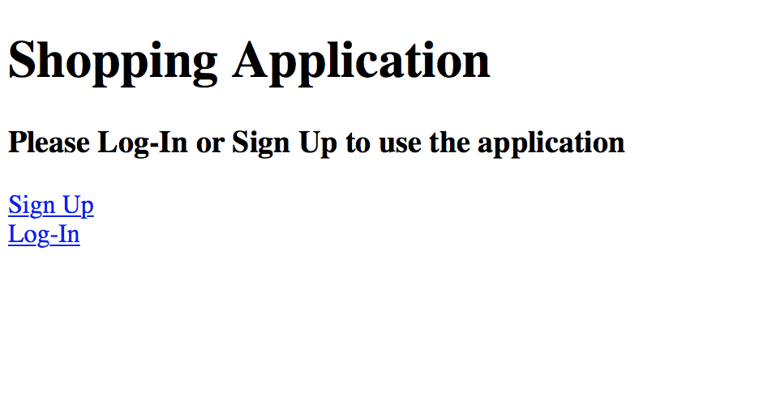
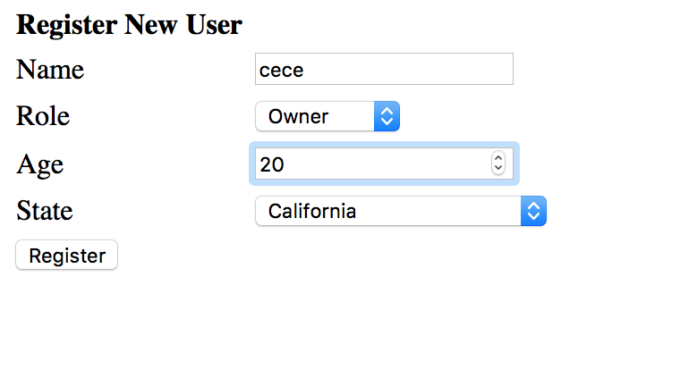
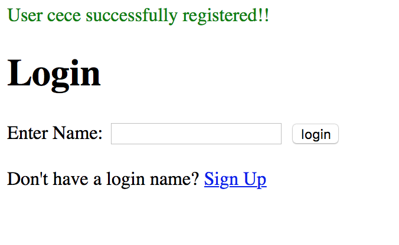
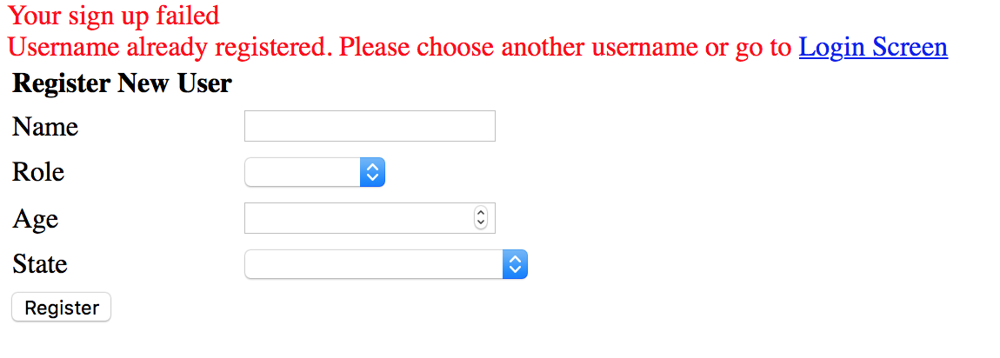
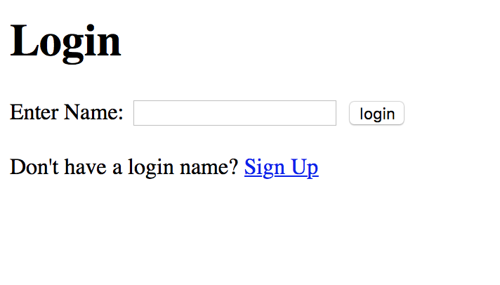
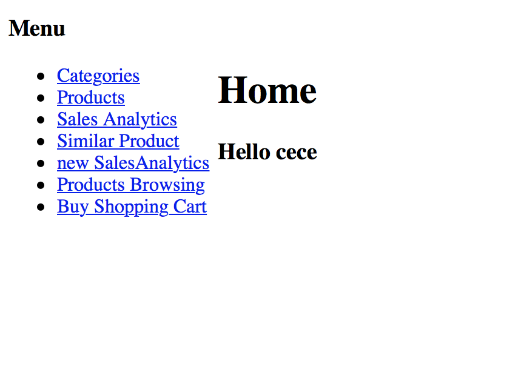

# ShoppingApp

This is a web application for a Shopping App designed in CSE135 class in University of California, San Diego.

## Pages
There are total 10 pages in this application, each with different functions and different design.

###  1. Home Page
 This page provides links to the login page and the sign-up page.

###  2. Signup Page
 In this page a user declares:
  the unique name he would like to have, in a textbox
  his role (owner or customer), in a dropdown menu
  his age, in a textbox
  his state, in a dropdown menu. The states is be displayed as full name “California”, “Nevada”, etc.

If the user signed up successfully, the page will jump to the login page with an information saying "User cece successfully registered!!". 

Otherwise, if the user failed to sign up, it will provide the reason for failure, such as "Your sign up failed
Username already registered. Please choose another username or go to Login Screen".

###  3. Login Page
 A user’s session with the application always starts from the “Login page”. In the “Login” page the user provides his name. The name is stored in the session.

###  4. menu Page
 The “Menu” page provides links to the other pages that depend on whether the user is an owner or a customer. The owners have access to all the pages that customers have access but not vice versa.

###  5. Category Page
 This page provides two links to the other pages, the login page and the sign-up page.

###  6. Product Page
 This page provides two links to the other pages, the login page and the sign-up page.

