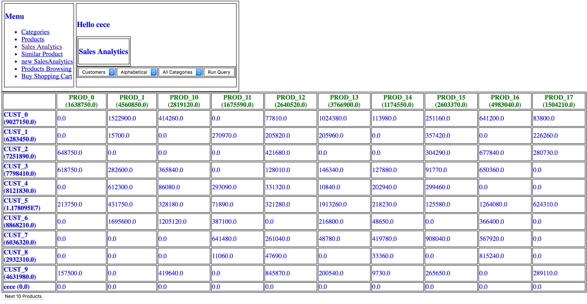
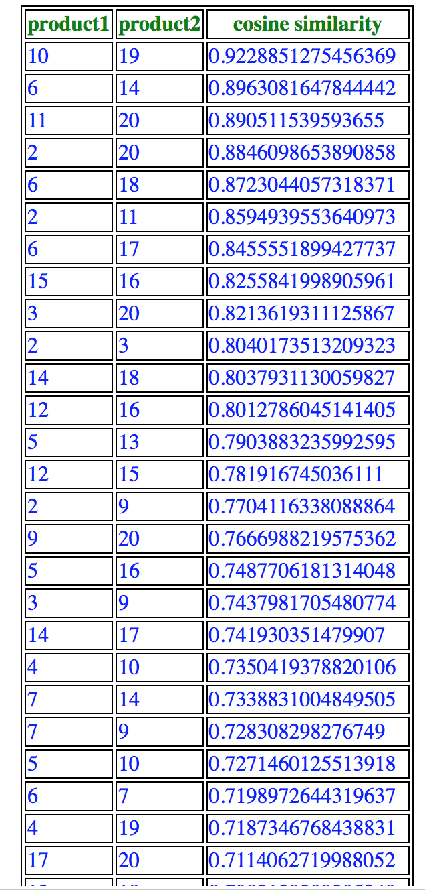
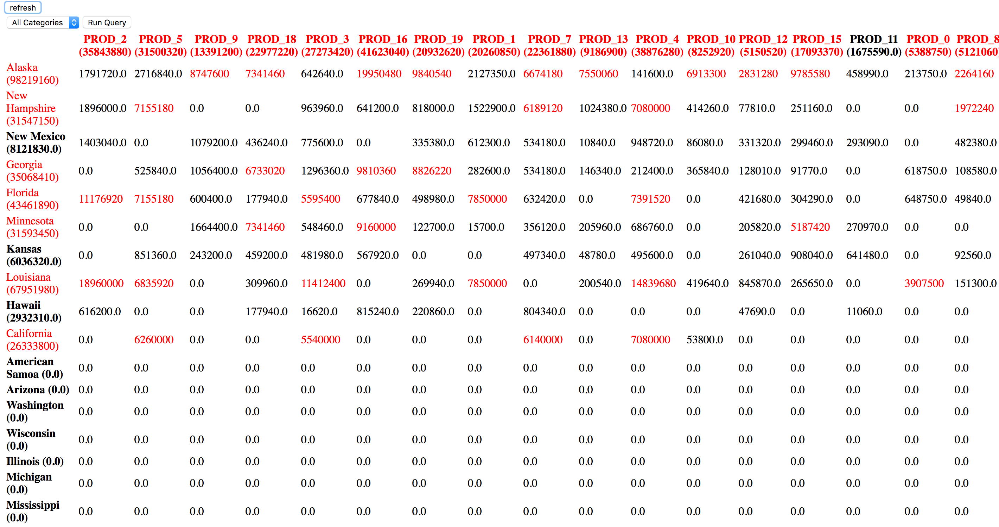

# ShoppingApp

This is a web application for a Shopping App designed in CSE135 class in University of California, San Diego.

## Pages
There are total 10 pages in this application, each with different functions and different design.

###  1. Home Page
 This page provides links to the login page and the sign-up page.

###  2. Signup Page
 In this page a user declares:
  the unique name he would like to have, in a textbox
  his role (owner or customer), in a dropdown menu
  his age, in a textbox
  his state, in a dropdown menu. The states is be displayed as full name “California”, “Nevada”, etc.

If the user signed up successfully, the page will jump to the login page with an information saying "User cece successfully registered!!". 

Otherwise, if the user failed to sign up, it will provide the reason for failure, such as "Your sign up failed
Username already registered. Please choose another username or go to Login Screen".

###  3. Login Page
 A user’s session with the application always starts from the “Login page”. In the “Login” page the user provides his name. The name is stored in the session.

###  4. Menu Page
 The “Menu” page provides links to the other pages that depend on whether the user is an owner or a customer. The owners have access to all the pages that customers have access but not vice versa.
 
 The menu page for owner:

 The menu page for customer:

###  5. Category Page
 Owners can view and create product categories. This page displays the name and description of each category in text box and text area respectively, and offers “Insert”, “Delete” and “Update” buttons, since the owners can insert, delete and update categories. The page will show information of whether successfully insert/update/delete the category, such as "Data Insert Successfully".

###  6. Product Page
 At the “Products” page the owners of the application can see all the products we have, and insert new products, where each product has a name, unique SKU, category and price.
 

The owner may also issue a search for products that contain a string provided by the owner in a search textbox, and the displayed products should be those that belong to the selected category and match the string of the search box.

###  7. Products Browsing Page
 This page offers to the customers the same product searching functionality that the “Products” page offers to the owners. If "Add to cart" is clicked, it will lead to the “Product Order” page, so that the customer can order this product.
 

###  8. Product Order Page
 This page displays the current contents of the shopping cart, and shows the product that was just chosen and asks the quantity of it that should be placed in the shopping cart. Upon a quantity being submitted, the shopping cart obtains one or more item. The application transfers the user to the “Products Browsing” page.
 

###  9. Buy Shopping Cart Page
  The customer sees the products, amounts and prices of what he has chosen. He sees the amount price for each product and also sees the total price of the shopping cart.

###  10. Confirmation Page
  A successful purchase leads to a “Confirmation” page that shows what was bought. After the purchase the shopping cart is emptied. The data of the purchase (what products/quantities were in the bought cart, who bought, when and at what price) are stored in the database. The confirmation page provides a link to the “Products Browsing” page so that the customer can start again.

###  11. Sales Analytics Page
 An owner can see a 2-dimensional report about sales aggregates on this dashboard page.
 
 **Rows dropdown menu:** offers the two options “Customers” and “States”. This dropdown menu allows the owner to choose whether the rows of the 2-dimensional report correspond to (option a) individual customers or (option b) customer states.
 
 **Columns dropdown menu:** correspond to individual products.
 
 **Order dropdown menu:** offers the two options “Alphabetical” and “Top-K”, which allows the owner to choose whether the display of customers, states and products is in “Alphabetical” order or according to the total sales dollars in the case of Top-K.
 
 If the rows are individual customers then a “Next 20 customers” submit button is also displayed. A “Next 10” products is shown at all times and has similar behavior.
 

###  12. Similar Products Page

One typical data mining operation is to find products that are often bought by the same customers, by **cosine similarity**.

###  13. New Sales Analytics Page

The page offers refresh buttons. Upon clicking the refresh button, the page must be updated very fast regardless of what is the displayed analysis. Every number that has been updated (after the refresh) must appear in red. “Number” refers to the numbers that have appeared in a row header, a column header or a cell. 

The order of rows and columns will not change by the Refresh, even if this leads to an out-of- order table. 

## Technologies

* Utilizing databases by SQL, postgres/ JSP 

* JavaScript

* Ajax (for Web format)
